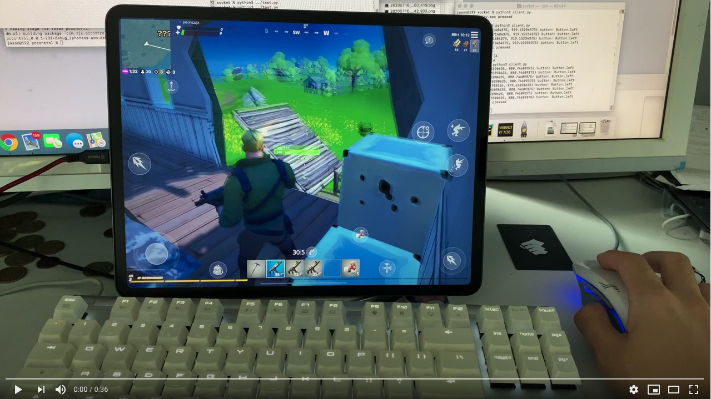
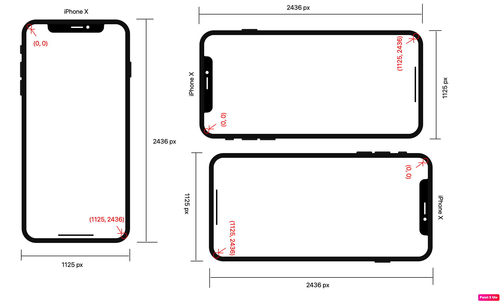

# IOS13-SimulateTouch V0.0.2

一个**系统级**的模拟触摸库，适用于iOS 11.0 - 13.6

需要先对iOS设备进行越狱。应用程序级触摸模拟库[PTFakeTouch](https://github.com/Ret70/PTFakeTouch)。可根据你的需要选择。

Discord: https://discord.gg/acSXfyz

给我个star吧！！！求求了

其他语言版本: [English](README.md)


## 简介
这个**开源，永久免费的**库作为一个iOS底层与应用层的桥梁，实现iOS11 - 13.6的模拟触摸。在应用层一行代码即可进行模拟点击，简洁方便（下文会有代码案例）。并且支持所有编程语言编写的应用层脚本或应用程序。同时，本库支持实时控制，0延迟控制你的iOS设备。

## 特性
* 模拟触控
	* 支持多指触控（这是唯一一个支持多指同时触控的库）
	* 可编程。支持任何编程语言，包括Python, C, C++, Objective-c, Java等等
	* 实时控制模式。可在电脑/平板/其他手机实时操控iOS设备
	* 系统级别模拟。无需注入到任何程序
* App界面
	* 脚本商店 - 用于下载脚本
	* 脚本编辑器 - 在手机上编写你的脚本
* 其他
	* 前台应用程序切换
	* 系统级消息弹窗
	* Unix命令行命令执行


## 安装方法
1. 打开Cydia - 源 - 编辑 - 添加 - http://47.114.83.227 (注意！！！是"http"而不是"https" 后续版本可能会变成https)
2. 安装**ZJXTouchSimulation**插件
3. 完成

## 代码示例
`Python Version`
```python
import socket
import time

# touch event types
TOUCH_UP = 0
TOUCH_DOWN = 1
TOUCH_MOVE = 2
SET_SCREEN_SIZE = 9

# 你可以复制粘贴这个函数到你自己的代码中使用
def formatSocketData(type, index, x, y):
    return '{}{:02d}{:05d}{:05d}'.format(type, index, int(x*10), int(y*10))

def horizontalSwipe():
    x = 300
    s.send(("101" + formatSocketData(TOUCH_DOWN, 7, x, 1000)).encode())  # 模拟点击按下。开头的"10"的意思是告诉插件本次任务为“点击模拟”。“10”后面的“1”是点击模拟的数据计数为1
    # 上面的那一行代码等同于s.send(("1011070300010000").encode())
    time.sleep(0.01) # 如果你在电脑上运行这段代码，把这个sleeptime改成0.2 （iOS环境下的python time.sleep会比他应该休眠的时间长很多）
    while x <= 600:
        s.send(("101" + formatSocketData(TOUCH_MOVE, 7, x, 1000)).encode())  # 把我们的手指7移向右边
        x += 5
        time.sleep(0.01)

    while x >= 100:
        s.send(("101" + formatSocketData(TOUCH_MOVE, 7, x, 1000)).encode())  # 把我们的手指7移向左边
        x -= 5
        time.sleep(0.01)

    s.send(("101" + formatSocketData(TOUCH_UP, 7, x, 1000)).encode())  # 释放手指

if __name__ == '__main__':
    s = socket.socket()
    s.connect(("127.0.0.1", 6000))  # 连接插件
    time.sleep(0.1)  # 连接之后要休眠0.1秒

    # 发送的数据格式应为 "{任务ID(2位)}{任务数据}"
    #############   切换App到前台演示   ##############
    s.send("11com.apple.Preferences".encode())  # 在最开始的“11”的意思是任务id是11 （启动app）。运行这一行会将"com.apple.Prefernces"放到前台运行 （运行“设置”App）。
    time.sleep(1)

    #############   系统级提示框演示   ##############
    s.send("12This Is Title;;Title and content should be splitted by two semicolons. I am going to close settings in 5 seconds.".encode())  # 在最开始的“12”的意思是任务id是12（显示提示框）。提示框标题和内容应该用两个分号隔开
    time.sleep(5)

    #############   以root权限运行终端代码演示    ##############
    s.send("13killall Preferences".encode())  # 在最开始的“13”的意思是任务id是13（运行终端代码）。在这里的运行的代码为“killall Preferences”（关闭“设置”app）
    time.sleep(1)

    # 接下来让我们看看模拟触摸部分
    # 模拟触摸的任务id为10。所以如果你想点击屏幕上的某点，你要发送"10" + "1" + formatSocketData(TOUCH_DOWN, 7, x, 1000)。“10”指明了任务id，“1”是数据计数为1
    # 其他的跟旧版本一样
    s.send("11com.apple.springboard".encode())  # 返回主屏幕
    horizontalSwipe() # 横向滑动模拟


    s.close()
```

实际上，一行代码就实现了iOS点击模拟
```python 
s.send(("101"+formatSocketData(TOUCH_DOWN, 7, 300, 400)).encode()) 
```
简单方便

手指移动模拟
```python
s.send(("101"+formatSocketData(TOUCH_MOVE, 7, 800, 400)).encode())  # tell the tweak to move our finger "7" to (800, 400)
```

抬起手指模拟
```python
s.send(("101"+formatSocketData(TOUCH_UP, 7, 800, 400)).encode())  # tell the tweak to touch up our finger "7" at (800, 400)
```

把他们结合起来
```python
s.send(("101"+formatSocketData(TOUCH_DOWN, 7, 300, 400)).encode())
time.sleep(1)
s.send(("101"+formatSocketData(TOUCH_MOVE, 7, 800, 400)).encode())
time.sleep(1)
s.send(("101"+formatSocketData(TOUCH_UP, 7, 800, 400)).encode())
```

这三行代码的意思就是，首先手指在 (300, 400)的地方按下，然后移动到 (800, 400)， 然后结束。所有的触摸时间都是即使反馈的，没有任何延迟。

再给你们一点我已经写好，你们可以直接复制粘贴使用的函数。这些函数的使用方法已经写在下面了

```python
# touch event types
TOUCH_UP = 0
TOUCH_DOWN = 1
TOUCH_MOVE = 2
SET_SCREEN_SIZE = 9

# you can copy and paste these methods to your code
def formatSocketData(type, index, x, y):
    return '{}{:02d}{:05d}{:05d}'.format(type, index, int(x*10), int(y*10))


def performTouch(socket, event_array):
    """触控模拟

	模拟在event_array里面的指定好的触控事件。event_array参数是一个包含着触控事件dictionary的数组。dictonary格式：{"type": touch type, "index": finger index, "x": x coordinate, "y": y coordinate}
	
    参数:
        socket: 连接到ZJXTouchSImulation插件的socket实例
        event_array: 触摸事件dictionary数组

    返回值:
        None

    调用示例:
        performTouch(s, [{"type": 1, "index": 3, "x": 100, "y": 200}]) # 在 (100, 300)用手指3按下
    """
    event_data = ''
    for touch_event in event_array:
        event_data += formatSocketData(touch_event['type'], touch_event['index'], touch_event['x'], touch_event['y'])
    socket.send('10{}{}'.format(len(event_array), event_data))

def switchAppToForeground(socket, app_identifier):
    """将App调至前台

    参数:
        socket: 连接到ZJXTouchSImulation插件的socket实例
        app_identifier: iOS App的bundle identifier

    返回值:
        None

    调用示例:
        switchAppToForeground(s, "com.apple.springboard") # 返回主屏幕
    """
    socket.send('11{}'.format(app_identifier).encode())

def showAlertBox(socket, title, content):
    """显示一个系统级的消息框

    参数:
        socket: 连接到ZJXTouchSImulation插件的socket实例
        title: 消息框的标题
        content: 消息框的内容

    返回值:
        None

    调用示例:
        showAlertBox(s, "Low Battery", "10% of battery remaining") # just a joke
    """
    socket.send('12{};;{}'.format(title, content).encode())

def executeCommand(socket, command_to_run):
    """使用root权限调用shell command

    参数:
        socket: 连接到ZJXTouchSImulation插件的socket实例
        command_to_run: 你想要运行的shell command

    返回值:
        None

    调用示例:
        executeCommand(s, "reboot") # 重启手机
    """
    socket.send('13{}'.format(command_to_run).encode())
```


## 使用示例 - 远程控制模拟触摸 & 电脑控制iOS设备玩游戏
**你可以通过本地脚本、电脑、甚至其他iOS设备来进行模拟触摸（为youtube链接，需要翻墙）**
[](https://youtu.be/gdSGO6rJIL4)

**使用键鼠控制iOS设备，模拟点击屏幕玩游戏。（为youtube链接，需要翻墙）**
[](https://youtu.be/XvvWHL6B3Tk)
[](https://youtu.be/mCkTzQJ2lC8)

## 使用说明

在安装后，ZJXTouchSimulation插件将在端口6000启动socket监听

如何控制iOS设备:
1. 使用socket连接到插件（端口6000）
2. 发送任务数据到插件（你需要遵循一定的数据格式，数据格式说明在下面）


### 需要发送的数据格式


**需要发送的数据由两部分组成，任务ID（task ID）与任务数据（task data）。其中，任务id为2位整数**

**** 
### 任务ID格式
任务ID为两位数整数

任务ID表:

| 任务       | 任务 ID | 描述                                               |
|:----------:|:----:|:---------------------------------------------------------:|
| 保留（暂时不可用） | < 10 | 保留做以后使用 |
| 触摸模拟   | 10   | 模拟触摸事件                     |
| 切换App至前台  | 11    | 把指定的application放置前台运行（如果该app没运行，则会启动该app）|
| 显示消息框 | 12    | 显示系统级消息框 |
| 终端命令执行   | 13    | 使用root权限运行Unix命令      |
| Comming soon | > 13 | Comming soon (you can submit suggestions via discord or email) |


****

### 任务数据格式

* [模拟触摸](#sending-touch-events)
* [切换前台运行]()
* [显示系统级消息框]()
* [终端命令执行]()

***1. 模拟触摸***

任务数据需要为十进制整数，如下说明


`Event Count（点击事件计数）`(1 digit): 指定有多少个触摸事件需要模拟。如果你同时有不同的触摸事件要模拟，那就增加这个计数，并且把要模拟的触摸事件数据添加到后面。 

`Type（事件类型）`(1 digit): 指定这个单个触摸事件的触摸类型. 

支持的触摸类型:

| 触摸事件      | Flag | 描述                                               |
|:----------:|:----:|:---------------------------------------------------------:|
| 松开手指   | 0    | 指定这个触摸事件为松开手指事件                     |
| 按下手指 | 1    | 指定这个触摸事件为按下手指事件                   |
| 移动手指 | 2    | 指定这个触摸事件为移动手指事件（模拟手指在屏幕上移动） |
| 设置屏幕尺寸   | 9    | 设置屏幕尺寸（已废弃）     |

`Touch Index（手指id）`(2 digits): 苹果支持多指触控，所以当发送模拟触摸事件时，你需要指定你的手指id。支持的id范围为0-20。也就是说，最多支持20个手指同时触摸。


`x Coordinate`(5 digits): 您要触摸的位置的x坐标。 前4位是整数部分，后一位是小数部分。 例如，如果要触摸屏幕上的（123.4，2432.1），则这部分填写“ 01234”。

`y Coordinate`(5 digits): 您要触摸的位置的x坐标。 前4位是整数部分，后一位是小数部分。 例如，如果要触摸屏幕上的（123.4，2432.1），则这部分填写“ 24321”。

### 重要说明

触摸坐标不取决于设备的方向。 请参阅下面的图片以获取更多信息。 无论你怎么放置设备，屏幕上的点击点都**不会被更改**。



***2. 切换前台运行***

任务数据应该为你想要切换到前台运行的app的bundle identifier

例如，如果你想运行“设置”，则任务数据则应为**"com.apple.Preferences“**。所以你需要发送的整个数据应为**"11com.apple.Preferences"** (11为任务id).


bundle identifier不等于应用程序名。你可以使用**[appster](http://cydia.saurik.com/package/com.jake0oo0.appster/)**来查找bundle identifier。

***3. 显示系统级消息框***

消息框由标题和内容组成。 您要显示的标题和内容应以两个分号（;;）分隔。 消息框是系统级别的。

例如，如果你想模拟“电池电量不足”消息框，只需发送"12电池电量不足；;仅剩10%电量。"。 （任务ID为12）


***4. 执行终端命令***

你可以将任务id指定为13来执行终端命令。该终端命令是以root权限执行的。任务数据为你想要执行的命令。**注意：使用root权限执行命令是非常强大但十分危险的。**

例如，你想要重启你的设备。那么发送"13reboot"（任务id为13）即可。如果你想要重启springboard，发送"13killall SpringBoard"即可。

## 联系我

Mail: jiz176@pitt.edu

Discord: https://discord.gg/acSXfyz


## Contact

Mail: jiz176@pitt.edu

Discord: https://discord.gg/acSXfyz
